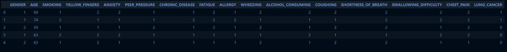
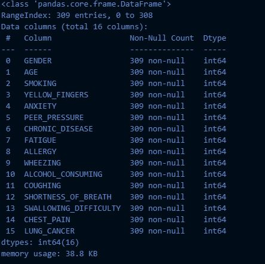
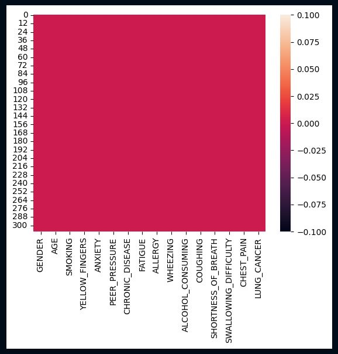
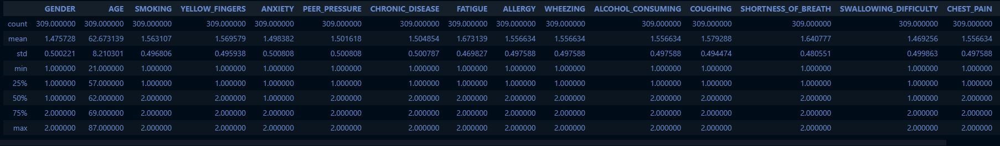
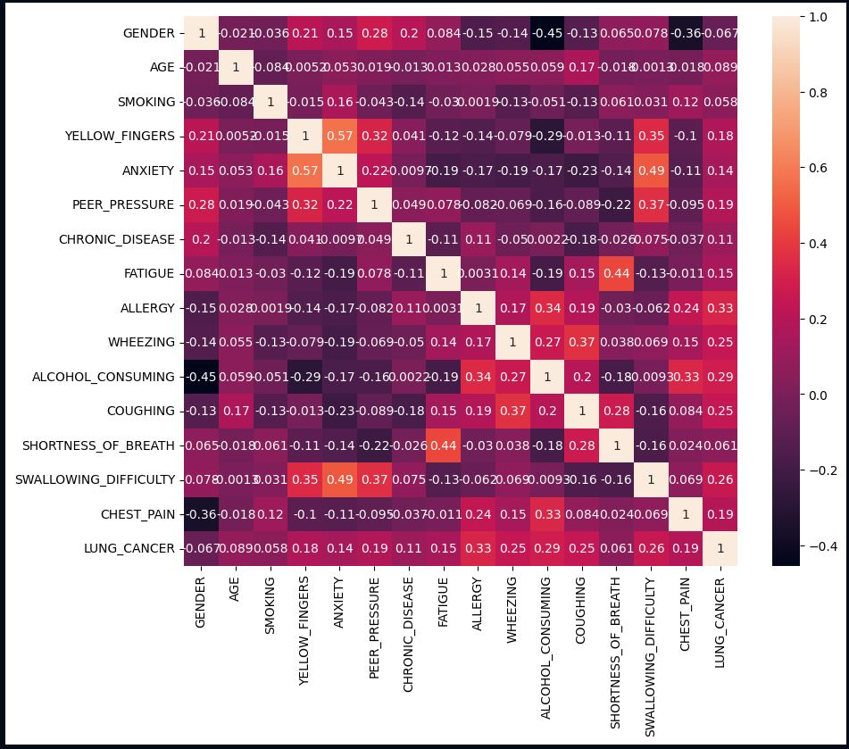
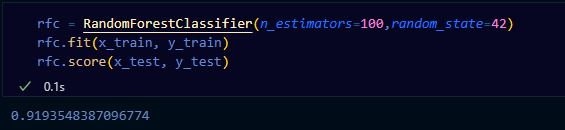
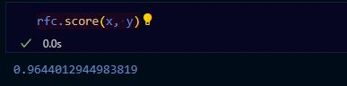
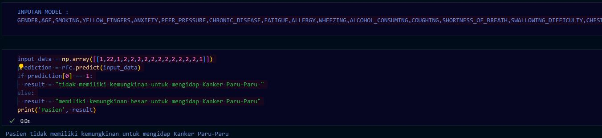
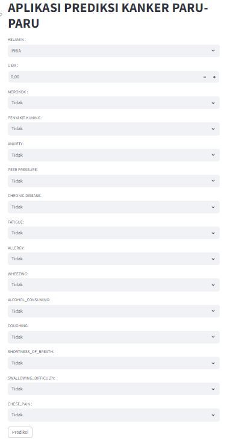

# MACHINE LEARNING PRE UTS
___
### NAMA : NUR RAHMA DIAH
### NIM : 211351107
### KELAS : MALAM A
___
## DOMAIN PROYEK
Prediksi kanker paru-paru ini merupakan suatu aplikasi yang mampu melakukan prediksi penyakit kanker paur-paru yang dapat membantu dalam memprediksi apakah seorang pasien memiliki atau tidaknya risiko yang signifikan untuk mengidap kanker paur-paru
, dan hal ini didasarkan pada data orang yang sudah mengidap kanker paur-paru.
___
## BUSINESS UNDERSTANDING
Tahap awal yang bertujuan untuk memprediksi apakah pasien memiliki peluang 
mengidap penyakit kanker paru-paru atau tidak. Dalam tahap ini, kita akan mengidentifikasi, merinci, dan memahami masalah yang ingin diselesaikan oleh aplikasi ini.

Bagian ini mencakup:
### PROBLEM STATEMENT
- Ketidaktahuan seseorang dalam mengidentifikasi kemungkinan apa saja yang bisa menyebabkan penyakit kanker paru-paru.
- Kurangnya rasa peduli bagi kesehatan diri sendiri.
### GOALS
- Mencegah resikonya terkena penyakit kanker paru-paru.
- Menanamkan rasa peduli terhadap diri sendiri terutama dalam hal kesehatan.
- Merubah pola hidup menjadi lebih sehat.
### SOLUSI STATEMENT
- Membuat aplikasi berbasis website yang mudah digunakan dan diakses bagi semua orang.
- Metode yang dipakai menggunakan metode REGRESI LINEAR.
___
## DATA UNDERSTANDING
Datasets yang saya gunakan berasal dari [Kaggle](https://www.kaggle.com/) datasets ini saya gunakan untuk memprediksi resiko terkenanya penyakit kanker paru-paru.
Berikut link datasets yang saya gunakan [disini](https://www.kaggle.com/datasets/mysarahmadbhat/lung-cancer)
## VARIABEL YANG DIGUNAKAN
- **GENDER** = Jenis Kelamin 
- **AGE** = Umur
- **SMOKING** = Apakah pernah meroko atau tidak
- **YELLOW_FINGERS** = Apakah pernah memiliki penyakit YELLOW FINGERS
- **ANXIETY** = Apakah pernah memiliki penyakit ANXIETY
- **PEER_PRESSURE** = Apakah pernah merasakan PEER PRESSURE
- **CHRONIC_DISEASE** = Apakah pernah memiliki penyakit CHRONIC DISEASE
- **FATIGUE** = Apakah sering merasakan FATIGUE
- **ALLERGY** = Apakah pernah memiliki penyakit ALLERGY
- **WHEEZING** = Apakah pernah memiliki penyakit WHEEZING
- **ALCOHOL_CONSUMING** = Apakah pernah mengkonsumsi alkohol
- **COUGHING** = Apakah pernah memiliki penyakit COUGHING
- **SHORTNESS_OF_BREATH** = Apakah pernah memiliki penyakit SHORTNESS_OF_BREATH
- **SWALLOWING_DIFFICULTY** = Apakah pernah memiliki penyakit SWALLOWING_DIFFICULTY
- **CHEST_PAIN** = Apakah pernah memiliki penyakit CHEST_PAIN
## DATA PREPARATION
Data preparation disini mencakup sebagai berikut :
### DATA COLLECTION
Untuk data collection disini, saya menggunakan datasets [Surver lung cancer](https://www.kaggle.com/datasets/mysarahmadbhat/lung-cancer).
### DATA DISCOVERY AND PROFILLING
- Hal yang pertama dilakukan yaitu membuat file ipynb
- Import library yang dibutuhkan
``` python
import pandas as pd
import numpy as np
import matplotlib.pypot as plt
import seaborn as sns
```
- Pemanggilan datasets yang akan dipakai
``` python
df = pd.read_csv("Surver lung cancer.csv")
```
- Deskripsi datasets
```python
df.head()
```

- Informasi datasets
```python
df.info()
```

- Memeriksa apakah datasets yang saya pakai ada data null atau kosong
``` python
sns.heatmap(df.isnull())
```
 <br>
Apabila tidak ada warna selain merah berarti data yang saya pakai aman tidak ada data null.
- describe datasets
``` python
df.describe()
```
 <br>
- Melihat tabel data exploration 
``` python
plt.figure(figsize=(10,8))
sns.heatmap(df.corr(), annot=True)
```

- Import library skicit-learn untuk melakukan Split data training dan data testing
``` python
from sklearn.model_selection import train_test_split
from sklearn import linear_model
from sklearn.ensemble import RandomForestClassifier
from sklearn.metrics import r2_score,confusion_matrix
```
- Seleksi Fitur x dan y
``` python
features = ['GENDER','AGE','SMOKING','YELLOW_FINGERS','ANXIETY','PEER_PRESSURE','CHRONIC_DISEASE','FATIGUE','ALLERGY','WHEEZING','ALCOHOL_CONSUMING','COUGHING','SHORTNESS_OF_BREATH','SWALLOWING_DIFFICULTY','CHEST_PAIN']
x = df[features]
y = df['LUNG_CANCER']
x.shape, y.shape
```
- Split data training dan data testing
``` python
x_train,x_test,y_train,y_test=train_test_split(x,y,test_size=0.4, random_state=42)
```
- Membuat model dengan metode Regresi Logistik
``` python
lr= linear_model.LogisticRegression(random_state = 42,max_iter= 100)
```
- Membuat hasil score
``` python
rfc = RandomForestClassifier(n_estimators=100,random_state=42)
rfc.fit(x_train, y_train)
rfc.score(x_test, y_test)
```

- hasil score seluruh data x dan y
``` python
rfc.score(x, y)
```

- Membuat model inputan meggunakan array
``` python
input_data = np.array([[1,22,1,2,2,2,2,2,2,2,2,2,2,2,1]])
prediction = rfc.predict(input_data)
if prediction[0] == 1:
  result = "tidak memiliki kemungkinan untuk mengidap Kanker Paru-Paru "
else:
  result = "memiliki kemungkinan besar untuk mengidap Kanker Paru-Paru"
print('Pasien', result)
```

-  Save menggunakan pickle untuk melanjutkan ke tahap pembuatan aplikasi berbasis website menggunakan bantuan streamlit
``` python
import pickle
filename ='prediksi_kanker.sav'
pickle.dump(rfc,open(filename,'wb'))
```
## DEPLOYMENT
Ini adalah aplikasi prediksi penyakit kanker paru-paru berbasis website yang sudah kita bangun menggunakan streamlit [APLIKASI](https://prediksikankerparuparu.streamlit.app/) <br>

